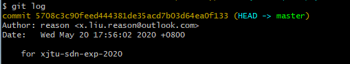
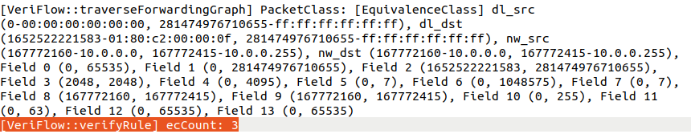
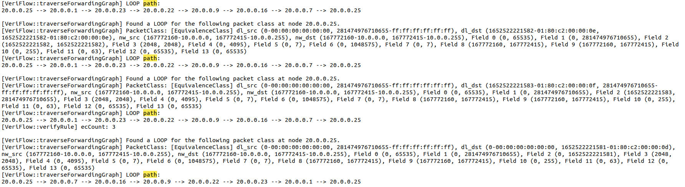
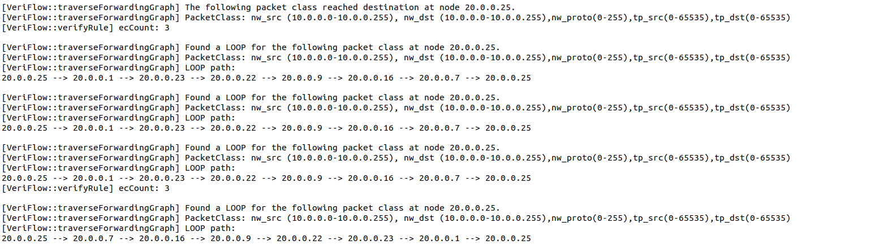
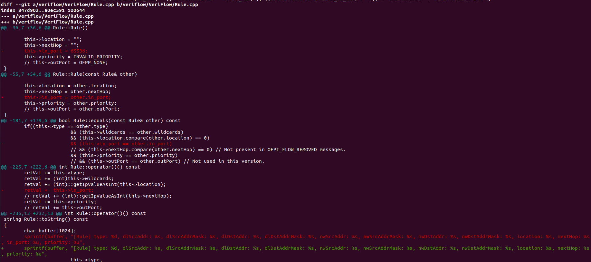
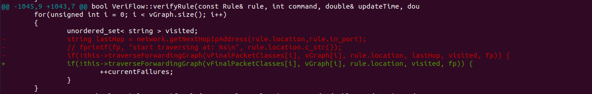
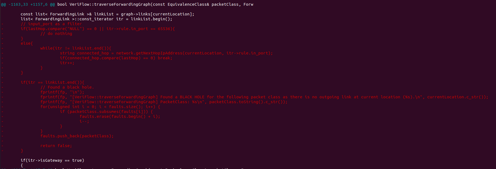
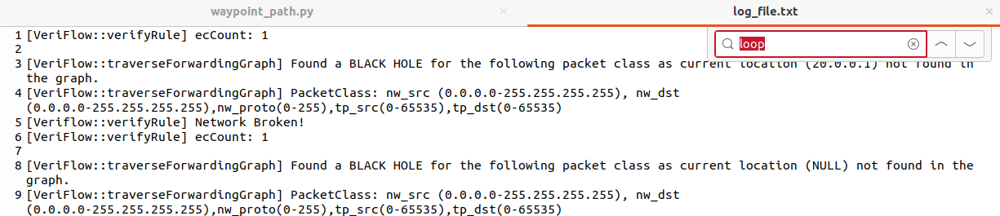
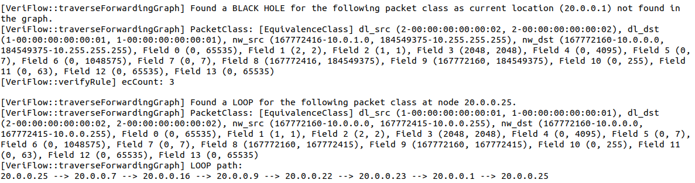

# VeriFLow Lab

## 一、说明

1. 文件夹files_in_other_folders中存放0001-for-xjtu-sdn-exp-2020.patch和Arpanet19723.txt，这两个文件都是需要放到其它文件夹中使用的。
2. 文件夹VeriFlow_modified中存放VeriFLow源码中修改过的文件。
3. 文件夹src_img中存放markdown的图片。
4. 其它文件即在当前目录。

## 二、实验准备

0. 从github下载VeriFlow并打上实验补丁

```bash
git clone https://github.com/samueljero/BEADS.git
cd BEADS
git am 0001-for-xjtu-sdn-exp-2020.patch
```

> [!CAUTION]
>
> 打补丁可能会报错，但这并不代表补丁没打上。使用下面的命令查看是否成功打上补丁
>
> ```bash
> git log
> ```
>
> 若终端输出如下则表示补丁已成功打上
>
> 

1. 编译VeriFlow

```bash
cd veriflow/VeriFlow
make clean all
```

2. 在自定义端口开启远程控制器，运行最短路程序

```bash
ryu-manager ofctl_rest.py shortest_path.py --ofp-tcp-listen-port 1024 --observe-links
```

3. 运行VeriFlow的proxy模式

   VeriFlow的proxy模式的cmd格式为：
   VeriFlow <veriflow_port> <controller_address> <controller_port> <topology_file><log_file>
   可用如下命令运行VeriFlow的proxy模式：

```bash
./VeriFlow 6633 127.0.0.1 1024 Arpanet19723.txt log_file.txt
```

> [!NOTE]
>
> 文件 Arpanet19723.txt 应该记得放入VeriFlow文件夹
>
> 在重新编译后运行上面的命令时可能提示套接字占用，可以执行下面的命令解决
>
> ```bash
>  sudo fuser -k 6633/tcp
> ```


4. 启动拓扑

```bash
sudo python Arpanet19723.py
```

5. 在拓扑中SDC ping MIT建立连接

```bash
mininet> SDC ping MIT
```

6. 下发从UTAH途经TINKER到达ILLINOIS的路径，在log文件中观察VeriFlow检测到的环路信息

```bash
sudo python waypoint_path.py  
```

## 三、实验内容与分析

### 3.1 基础实验部分

####  3.1.1 EC数目的打印  

**对每条验证的规则，实验要求输出这条规则所影响的EC数目**  

对VeriFlow.cpp中的`VeriFlow::verifyRule`函数作修改，打印等价类数量即可

修改前:

```cpp
...
if(ecCount == 0)
{
    fprintf(stderr, "[VeriFlow::verifyRule] Error in rule: %s\n", rule.toString().c_str());
    fprintf(stderr, "[VeriFlow::verifyRule] Error: (ecCount = vFinalPacketClasses.size() = 0). Terminating process.\n");
    exit(1);
}
else
{
    // fprintf(stdout, "\n");
    // fprintf(stdout, "[VeriFlow::verifyRule] ecCount: %lu\n", ecCount);
}
...
```

修改后:

```cpp
...
if(ecCount == 0)
	{
		fprintf(stderr, "[VeriFlow::verifyRule] Error in rule: %s\n", rule.toString().c_str());
		fprintf(stderr, "[VeriFlow::verifyRule] Error: (ecCount = vFinalPacketClasses.size() = 0). Terminating process.\n");
		exit(1);
	}
	else
	{
		 fprintf(stdout, "\n");
		 fprintf(stdout, "[VeriFlow::verifyRule] ecCount: %lu\n", ecCount);
		 fprintf(fp, "[VeriFlow::verifyRule] ecCount: %lu\n", ecCount);
	}
...
```

> [!NOTE]
>
> 对VeriFlow源码的更改都需要重新编译

此时再次运行可以发现EC数目已打印



#### 3.1.2 环路路径的打印  

**本实验要求打印出环路的信息，包括出现环路的提示信息，EC的基本信息和环路路径上的IP地址**  

由于`traverseForwardingGraph`函数中的`visited`类型为`unordered_set`（无序集），因此无法通过`visited`打印环路信息。

引入一个新表`path`，它是`vector<string>`数组，通过该表记录环路信息并打印。

为了引入`path`表，需要作以下工作：

- 在VeriFlow.h中修改`traverseForwadingGraph`的声明

  ```cpp
  bool traverseForwardingGraph(const EquivalenceClass& packetClass, ForwardingGraph* graph, const string& currentLocation, const string& lastHop, unordered_set < string > visited, FILE* fp,vector<string>& path);
  ```

- 在VeriFlow.cpp中的`VeriFlow::verifyRule`函数中创建`path`表（`visited`表创建处）

- 在VeriFlow.cpp中修改`traverseForwardingGraph`函数的调用（共两处）

- 在VeriFlow.cpp中的`VeriFlow::traverseForwardingGraph`函数定义处作修改，并加入记录和输出环路信息的代码

  ```cpp
  ...
  if(visited.find(currentLocation) != visited.end())
  	{
  		// Found a loop.
  		fprintf(fp, "\n");
  		fprintf(fp, "[VeriFlow::traverseForwardingGraph] Found a LOOP for the following packet class at node %s.\n", currentLocation.c_str());
  		fprintf(fp, "[VeriFlow::traverseForwardingGraph] PacketClass: %s\n", packetClass.toString().c_str());
  		fprintf(fp, "[VeriFlow::traverseForwardingGraph] LOOP path:\n");
  		for(unsigned int i = 0; i < path.size(); i++) {
  			fprintf(fp, "%s --> ", path[i].c_str());
  		}
  		fprintf(fp, "%s\n", currentLocation.c_str());
  		...
  }
  
  visited.insert(currentLocation);
  path.push_back(currentLocation);
  ...
  ```

重新编译，完成实验操作。发现日志中出现了环路路径信息

20.0.0.25 --> 20.0.0.1 --> 20.0.0.23 --> 20.0.0.22 --> 20.0.0.9 --> 20.0.0.16 --> 20.0.0.7 --> 20.0.0.25



#### 3.1.3 打印出环路对应的EC的相关信息  

**EC的基本信息显示为14个域的区间形式，为方便查错，现简化EC信息的表示形式，仅从14个域中提取TCP/IP五元组作为主要信息显示**  

EC的基本信息显示通过调用`packetClass.toString`函数显示。 `packetClass`是`EquivalenceClass`的对象，因此在`EquivalenceClass.cpp`中修改`to_String`函数即可。其中，需要显示的信息是在`EquivalenceClass.h`中声明的。

修改如下：

```cpp
string EquivalenceClass::toString() const
{
	char buffer[1024];

	sprintf(buffer, "nw_src (%s-%s), nw_dst (%s-%s),nw_proto(%lu-%lu),tp_src(%lu-%lu),tp_dst(%lu-%lu)",
			::getIpValueAsString(this->lowerBound[NW_SRC]).c_str(),
			::getIpValueAsString(this->upperBound[NW_SRC]).c_str(),
			::getIpValueAsString(this->lowerBound[NW_DST]).c_str(),
			::getIpValueAsString(this->upperBound[NW_DST]).c_str(),
			this->lowerBound[NW_PROTO], 
			this->upperBound[NW_PROTO],
			this->lowerBound[TP_SRC],
			this->upperBound[TP_SRC],
			this->lowerBound[TP_DST], 
			this->upperBound[TP_DST]);

	string retVal = buffer;
	return retVal;
}
```

重新编译，完成实验操作。发现日志中EC的显示格式 已被修改




#### 3.1.4 分析原始代码与补丁代码的区别，思考为何需要添加补丁  

添加完补丁之后，可用以下命令查看补丁修改的文件内容，按q退出。  

```bash
git diff HEAD origin/HEAD  
```

1. `Rule`类中加入了`in_port`属性



补充的代码加入了`in_port`属性并完成了相应头文件、构造函数和打印等内容的修改。加入`in_port`属性是有必要的，因为`in_port`是流表中重要的一项，补充该属性能提高对规则的处理能力。

2. 环路检测优化和黑洞检测优化

在原代码中，`itr`是固定不变的(第一项)，因此只能判定环路而无法记录环路的全部信息。为了记录环路的全部信息需要`itr`是变化的，补充的代码实现了这一点。在加入`in_port`之后，就可以引入上一跳`lastHop`，从而设置过滤条件。

网络黑洞是指在网络路径中，数据包被路由到一个无法到达目的地的位置，并且这些数据包在到达该位置后被丢弃或消失。在网络黑洞中，数据包被“吸收”而不会被转发到其他节点，导致数据无法正常传输。网络黑洞可能由配置错误、设备故障或恶意攻击等原因引起。





该部分补丁代码的流程：

- 获取了当前节点`currentLocation`的所有链路`linkList`，并用迭代器 `itr` 开始遍历。

- 检查 `lastHop` 是否为 `NULL` 或 `itr->rule.in_port` 是否为 `65536`，这两种情况下直接跳过处理。

- 否则，遍历 `linkList`，查找与 `lastHop` 匹配的连接（此处还避免了下一跳与上一跳相同）。

- 如果 `itr` 到达 `linkList` 的末尾`linkList.end()`，表示没有找到与 `lastHop` 匹配的连接。

- 这意味着当前节点没有任何有效的出边，可以视为一个网络黑洞。

- 检测到黑洞后，记录相关信息。

  

补丁代码完善了VeriFlow的功能，使其能够更有效地处理网络环路与网络黑洞。

### 3.2 拓展实验部分  

#### 3.2.1 添加优先级出错

**若修改 waypoint_path.py 代码中被添加规则的优先级字段，VeriFlow的检测结果会出错，试描述错误是什么，并解释出错的原因**  

将waypoint_path.py 中 `add_flow`函数的默认优先级`priority`设置为`1`（与shortest_path.py中下发流表的优先级一致），重复实验操作，发现`SDC ping MIT`不通但日志文件中没有记录环路信息，VeriFlow的检测结果出错。



在实际网络中，若下发匹配域相同且具有相同优先级的流表时，新流表会覆盖旧流表，因此重复实验操作后仍然会产生环路。如果VeriFlow是完备的，则应该在日志中记录环路信息。

下面分析出错的原因：

VeriFlow终端会输出Removing fault!信息，这可以定位到VeriFlow.cpp中的`traverseForwardingGraph`函数。打印这个信息是在VeriFlow认为路径可达但出现了错误时，这个错误是因为原来的规则没有被移除。以下两点是VeriFlow实现时忽略的地方：

1. 对规则的添加是在VeriFlow.cpp中的`addRule`中完成的，这个函数对规则的处理依托于类`Rule`，在规则添加时该函数并不会删去旧规则，这是因为该类并不完善，没有办法区分新旧规则。
2. VeriFlow.cpp中还会按照规则优先级确定当前节点的链路顺序，此过程同样没有删去旧规则，而且对链路排序使用的还是稳定排序方法`sort`。

#### 3.2.2 选域验证

**在VeriFlow支持的14个域中，挑选多个域（不少于5个）进行验证，输出并分析结果**  

VeriFlow支持的14个域声明于EquivalenceClass.h。

```cpp
enum FieldIndex
{
	IN_PORT, // 0
	DL_SRC,
	DL_DST,
	DL_TYPE,
	DL_VLAN,
	DL_VLAN_PCP,
	MPLS_LABEL,
	MPLS_TC,
	NW_SRC,
	NW_DST,
	NW_PROTO,
	NW_TOS,
	TP_SRC,
	TP_DST,
	ALL_FIELD_INDEX_END_MARKER, // 14
	METADATA, // 15, not used in this version.
	WILDCARDS // 16
};
```

选取`IN_PORT`,`DL_TYPE`,`NW_SRC`,`NW_DST`,`MPLS_TC`进行验证。

修改了`add_flow`函数及其调用，具体代码见waypoint_path2.py。

为了观察现象，把之前修改的EquivalenceClass.cpp复原。重新编译，完成实验操作。



可以看出VeriFlow成功验证出环路。

注：网上可以找到的资料一般都加入了`DL_SRC`和`DL_DST`进行验证，但是我测试有问题，即VeriFlow发现环路，但是事实上仍然可以ping通。